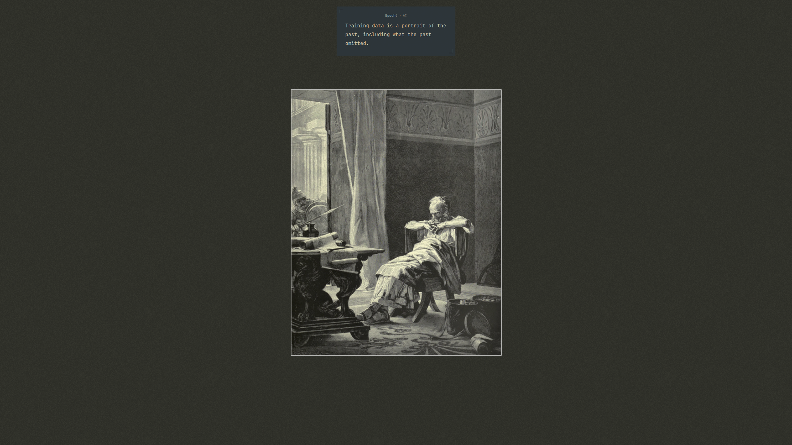

# Epoché

> A moment of reflection between signal and action.

Epoché is a native Omarchy plugin that occasionally surfaces a short thought
about development, systems and operations, or AI engineering. It creates a
brief pause without behaving like an alert, assistant, or productivity coach.

The name comes from the Greek ἐποχή: suspending judgment for a moment before
reaching a conclusion.

## Preview



## Why Epoché?

Technical work produces a constant stream of signals. Epoché interrupts that
stream only briefly, with a calm observation intended to remain useful beyond
a specific tool, incident, or trend.

Its bundled corpus is curated rather than collected as an unrestricted set of
quotes or tips. The 72 thoughts are divided equally between:

- **DEV** — software design, code, testing, review, and maintenance;
- **SYS** — systems, operations, reliability, and infrastructure;
- **AI** — models, agents, evaluation, uncertainty, and automation.

## Features

- Native Omarchy/Quickshell integration
- Einklammerung presentation with two open corner marks
- Passive, click-through, top-center appearance
- Local and offline corpus of 72 curated thoughts
- 24 thoughts each for DEV, SYS, and AI
- English and French catalogs
- Automatic locale detection with English fallback
- Configurable display interval
- No immediate repetition when the corpus permits another choice
- No network access, telemetry, analytics, or runtime LLM

## Installation

Install and enable Epoché directly from its public GitHub repository:

```sh
omarchy plugin add https://github.com/marcelinux303/epoche.git --enable
```

The permanent plugin ID is `io.github.marcelinux303.epoche`.

## Behavior

Epoché displays one thought on the focused screen, or on the first available
screen when no focused screen can be resolved. Each thought remains visible for
approximately 5–12 seconds according to its length.

The default interval is 45 minutes. Repeated summons replace the pending
thought without building an animation queue, and closing the panel cancels
deferred work. The surface does not take keyboard focus and does not reserve
screen space.

## Usage and configuration

Summon a thought manually:

```sh
omarchy-shell shell summon io.github.marcelinux303.epoche
```

Use automatic language selection, which is the V1 default:

```sh
omarchy-shell shell call io.github.marcelinux303.epoche setLanguage auto
```

Select English or French explicitly:

```sh
omarchy-shell shell call io.github.marcelinux303.epoche setLanguage en
omarchy-shell shell call io.github.marcelinux303.epoche setLanguage fr
```

The language override is runtime-only in V1. A change applies to the next
appearance and does not replace a thought that is already visible.

Change the interval in minutes:

```sh
omarchy-shell shell call io.github.marcelinux303.epoche setInterval 60
```

The accepted interval range is 1–1440 minutes. The default is 45 minutes.

## Languages

Epoché V1 supports:

- `auto` — checks the ordered UI language list and then the current locale;
- `en` — English;
- `fr` — French.

If no supported locale is found, Epoché uses English. If a French catalog entry
is unavailable or invalid, the matching English thought is used. Both catalogs
are bundled with the plugin; no translation service or external API is
contacted.

## Privacy and security

Epoché is local-first and offline. Its V1 runtime:

- makes no network requests;
- collects no data;
- uses no telemetry or analytics;
- performs no behavioral tracking or machine diagnostics;
- runs no AI model or LLM;
- executes no shell command or external process;
- reads its thought corpus from files bundled with the plugin.

Omarchy plugins execute unsandboxed with the user's permissions inside the
long-running shell process. Users should review plugin source and changes before
installation or update. Epoché minimizes its capabilities, but it is not a
security sandbox.

## Removal

Remove Epoché through the Omarchy plugin manager:

```sh
omarchy plugin remove io.github.marcelinux303.epoche
```

## Contributing

Issues and focused pull requests are welcome.

The corpus is curated rather than an unrestricted quote collection. A proposed
thought should:

- use exactly one category: DEV, SYS, or AI;
- be short, technical, reflective, and non-prescriptive;
- avoid direct address and assumptions about a user or machine;
- remain useful over time where possible;
- avoid alerts, diagnoses, productivity coaching, and motivational language;
- provide idiomatic English and French versions with conceptual parity;
- use a unique, stable lowercase kebab-case ID;
- preserve UTF-8/NFC text and complete EN/FR ID coverage.

Corpus changes should pass the automated checks and receive editorial review.

## Development and validation

Epoché has no build step or npm dependency. From a clean repository checkout,
run:

```sh
node tests/check.mjs
node --check PulseModel.js
node --check tests/check.mjs
node --check tests/v1-model.mjs
node --check tests/v1-lifecycle.mjs
node --check tests/v1-ui.mjs
/usr/lib/qt6/bin/qmlformat Pulse.qml > /tmp/Pulse.qml.formatted
/usr/lib/qt6/bin/qmlformat PulseCard.qml > /tmp/PulseCard.qml.formatted
/usr/lib/qt6/bin/qmllint Pulse.qml PulseCard.qml
omarchy plugin validate .
git diff --check
```

`qmllint` may report warnings for runtime-provided Omarchy/Quickshell imports and
dynamic theme properties when it runs outside the complete shell environment.
It should still exit successfully without a syntax error.

## Project information

- Plugin ID: `io.github.marcelinux303.epoche`
- Version: `1.0.0`
- Plugin kind: `panel`
- License: [MIT](LICENSE)
- Repository: `https://github.com/marcelinux303/epoche`
